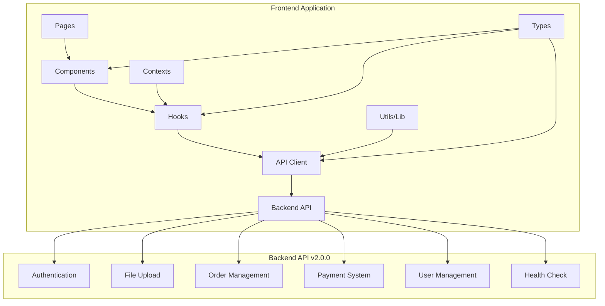

# Design Document

## Overview

This design document outlines the comprehensive update of the DocFiscal frontend application to align with the backend OpenAPI specification v2.0.0. The update involves modifying API endpoints, standardizing response formats, updating components and hooks, and ensuring all parts of the application work seamlessly with the new backend.

## Architecture

The frontend architecture will maintain its current structure but with updated API integration:



## Components and Interfaces

### 1. API Client Updates

The `apiClient` class will be updated to match the new OpenAPI specification:

#### Authentication Methods
- `register()` - Updated to handle new response format
- `login()` - Updated to handle new token structure
- `refreshAccessToken()` - Updated endpoint and payload
- `logout()` - Updated to call backend endpoint
- `getProfile()` - Updated to use `/api/auth/me`

#### File Upload Methods
- `uploadFile()` - Updated to use `/api/upload/` (with trailing slash)
- `getUploadProgress()` - Updated response format handling
- `cancelUpload()` - Updated to use DELETE method

#### Order Management Methods
- `getOrders()` - Updated query parameters (sort/order instead of sort_by/sort_order)
- `getOrder()` - Updated response format
- `retryOrder()` - Updated endpoint
- `downloadOrder()` - Updated error handling for 410 responses

#### Payment Methods
- `initiatePayment()` - Updated to use `/api/payments/orders/{order_id}/payment`
- `getPaymentStatus()` - Updated to use `/api/payments/{payment_id}` (not `/status`)

#### User Management Methods (New)
- `updateProfile()` - New method for `/api/users/me`
- `changePassword()` - New method for `/api/users/me/password`

### 2. Type System Updates

Updated TypeScript interfaces to match OpenAPI schemas:

```typescript
// Updated response format
interface ApiResponse<T = any> {
  success: boolean;
  data?: T;
  message: string;
}

// Updated error format
interface ApiError {
  success: false;
  error: string;
  message: string;
  details?: {
    field_errors?: Record<string, string[]>;
    retry_after?: number;
    guidance?: string;
  };
  request_id?: string;
}

// Updated payment response
interface PaymentResponse {
  payment_id: string;
  order_id: string;
  amount: number;
  currency: string;
  payment_method: string;
  status: string;
  checkout_url: string;
  qr_code?: string;
  expires_at: string;
}

// Updated order structure
interface Order {
  id: string;
  user_id: string;
  filename: string;
  file_size: number;
  status: 'pending_payment' | 'processing' | 'completed' | 'failed';
  created_at: string;
  updated_at: string;
  processing_started_at?: string;
  processing_completed_at?: string;
  error_message?: string;
  download_url?: string;
  expires_at?: string;
}
```

### 3. Component Updates

#### UploadArea Component
- Update to handle new upload response format
- Process `upload_id` and `order_id` from response
- Handle new error format structure

#### OrderStatusCard Component
- Update to display new order status values
- Handle new payment flow with `checkout_url`
- Process new error message format

#### OrderHistoryTable Component
- Update pagination to use new query parameters
- Handle new order data structure
- Update status display logic

### 4. Hook Updates

#### useAuth Hook
- Update to handle new authentication response format
- Process new token structure
- Handle new user profile format

#### useFileUpload Hook
- Update to process new upload response format
- Handle new progress tracking structure
- Update error handling for new format

#### usePaymentFlow Hook
- Update to use new payment endpoints
- Handle new payment response format
- Process `checkout_url` and `qr_code` fields
- Update status polling logic

### 5. Page Updates

#### Dashboard Page
- Update order fetching to use new endpoints
- Handle new pagination format
- Update payment initiation flow
- Process new order statistics

#### Upload Page
- Update file upload flow
- Handle new response format
- Update success/error messaging

#### Payment Pages
- Update to handle new payment flow
- Process new payment status format
- Handle new error scenarios

## Data Models

### Updated Order Model
```typescript
interface Order {
  id: string;
  user_id: string;
  filename: string;
  file_size: number;
  status: 'pending_payment' | 'processing' | 'completed' | 'failed';
  created_at: string;
  updated_at: string;
  processing_started_at?: string;
  processing_completed_at?: string;
  error_message?: string;
  download_url?: string;
  expires_at?: string;
}
```

### Updated Payment Model
```typescript
interface Payment {
  id: string;
  order_id: string;
  status: 'pending' | 'completed' | 'failed' | 'expired';
  amount: number;
  currency: string;
  payment_method: 'pix' | 'credit_card';
  created_at: string;
  completed_at?: string;
  failure_reason?: string;
}
```

### Updated User Model
```typescript
interface User {
  id: string;
  name: string;
  email: string;
  created_at: string;
  updated_at: string;
}
```

## Correctness Properties

*A property is a characteristic or behavior that should hold true across all valid executions of a system-essentially, a formal statement about what the system should do. Properties serve as the bridge between human-readable specifications and machine-verifiable correctness guarantees.*

Based on the prework analysis, the following properties will ensure the frontend correctly integrates with the updated backend API:

### Authentication Properties

Property 1: Registration endpoint consistency
*For any* valid user registration data, the API client should send requests to `/api/auth/register` with the correct payload structure
**Validates: Requirements 1.1**

Property 2: Login endpoint and response handling
*For any* valid login credentials, the API client should send requests to `/api/auth/login` and correctly process the standardized response format
**Validates: Requirements 1.2**

Property 3: Token refresh endpoint consistency
*For any* valid refresh token, the API client should use `/api/auth/refresh` with the correct payload structure
**Validates: Requirements 1.3**

Property 4: Profile endpoint consistency
*For any* profile request, the API client should use the `/api/auth/me` endpoint
**Validates: Requirements 1.4**

Property 5: Logout endpoint consistency
*For any* logout request, the API client should call the `/api/auth/logout` endpoint
**Validates: Requirements 1.5**

### File Upload Properties

Property 6: Upload endpoint format consistency
*For any* file upload, the API client should use the `/api/upload/` endpoint with trailing slash
**Validates: Requirements 2.1**

Property 7: Upload progress endpoint consistency
*For any* upload ID, the API client should use `/api/upload/{upload_id}/progress` endpoint for progress checking
**Validates: Requirements 2.2**

Property 8: Upload cancellation method consistency
*For any* upload cancellation, the API client should use DELETE method on `/api/upload/{upload_id}` endpoint
**Validates: Requirements 2.3**

Property 9: Upload response processing
*For any* upload response, the frontend should correctly extract upload_id and order_id from the standardized response format
**Validates: Requirements 2.4**

### Order Management Properties

Property 10: Order listing parameter consistency
*For any* order listing request, the API client should use `/api/orders` with proper query parameters (page, limit, status, sort, order)
**Validates: Requirements 3.1**

Property 11: Order detail endpoint consistency
*For any* order ID, the API client should use `/api/orders/{order_id}` endpoint for order details
**Validates: Requirements 3.2**

Property 12: Order retry method consistency
*For any* order retry request, the API client should use POST method on `/api/orders/{order_id}/retry` endpoint
**Validates: Requirements 3.3**

Property 13: Order download endpoint consistency
*For any* order download request, the API client should use `/api/orders/{order_id}/download` endpoint
**Validates: Requirements 3.4**

Property 14: Order response processing
*For any* order response, the frontend should correctly process the standardized pagination and order data structures
**Validates: Requirements 3.5**

### Payment Properties

Property 15: Payment initiation endpoint consistency
*For any* payment initiation, the API client should use POST method on `/api/payments/orders/{order_id}/payment` endpoint
**Validates: Requirements 4.1**

Property 16: Payment status endpoint consistency
*For any* payment status check, the API client should use `/api/payments/{payment_id}` endpoint (not the old `/status` suffix)
**Validates: Requirements 4.2**

Property 17: Payment response processing
*For any* payment response, the frontend should correctly extract checkout_url and qr_code fields from the standardized format
**Validates: Requirements 4.3**

Property 18: Payment method support
*For any* payment method ('pix' or 'credit_card'), the frontend should process it correctly
**Validates: Requirements 4.4**

Property 19: Payment status polling
*For any* payment in progress, the frontend should implement proper status polling to handle webhook-triggered updates
**Validates: Requirements 8.3**

### User Management Properties

Property 20: Profile update endpoint consistency
*For any* profile update, the API client should use PUT method on `/api/users/me` endpoint
**Validates: Requirements 5.1**

Property 21: Password change endpoint consistency
*For any* password change, the API client should use PUT method on `/api/users/me/password` endpoint
**Validates: Requirements 5.2**

Property 22: Profile response processing
*For any* profile update response, the frontend should correctly process the standardized user profile response format
**Validates: Requirements 5.3**

Property 23: Password change validation
*For any* password change request, the frontend should require both current_password and new_password fields
**Validates: Requirements 5.4**

### Response Format Properties

Property 24: Standard response format handling
*For any* API response, the frontend should correctly handle the standardized format with success, data, and message fields
**Validates: Requirements 6.1**

Property 25: Error format processing
*For any* error response, the frontend should correctly process the standardized error format with error codes and field_errors
**Validates: Requirements 6.2**

Property 26: Error message display
*For any* error response, the frontend should use the message field for error display
**Validates: Requirements 6.3**

Property 27: Validation error display
*For any* validation error response, the frontend should display field-specific errors from the details.field_errors object
**Validates: Requirements 6.4**

### System Health Properties

Property 28: Health check endpoint consistency
*For any* health check request, the API client should use `/health` endpoint without requiring authentication
**Validates: Requirements 7.1**

Property 29: Health response processing
*For any* health response, the frontend should correctly process the detailed health status including all services
**Validates: Requirements 7.2**

Property 30: Health information display
*For any* health data, the frontend should display database, storage, and payment_provider status
**Validates: Requirements 7.3**

### Query Parameter Properties

Property 31: Pagination parameter consistency
*For any* paginated request, the frontend should use 'page' and 'limit' parameters consistently
**Validates: Requirements 9.1**

Property 32: Sorting parameter consistency
*For any* sorting request, the frontend should use 'sort' and 'order' parameters (not 'sort_by' and 'sort_order')
**Validates: Requirements 9.2**

Property 33: Order filtering support
*For any* order filtering request, the frontend should support 'status' parameter with valid enum values
**Validates: Requirements 9.3**

Property 34: Pagination response processing
*For any* pagination response, the frontend should correctly process the standardized pagination object
**Validates: Requirements 9.4**

### File Download Properties

Property 35: Download link expiration handling
*For any* download request that returns 410, the frontend should handle "Download link expired" responses appropriately
**Validates: Requirements 10.1**

Property 36: Download header processing
*For any* download response, the frontend should correctly handle Content-Disposition headers
**Validates: Requirements 10.2**

Property 37: Download error messaging
*For any* failed download, the frontend should display appropriate error messages based on error codes
**Validates: Requirements 10.3**

Property 38: Download retry options
*For any* expired download link, the frontend should provide options to regenerate or retry
**Validates: Requirements 10.4**

<function_calls>
<invoke name="prework">
<parameter name="featureName">api-endpoints-update

## Error Handling

### Standardized Error Processing

The frontend will implement consistent error handling across all API interactions:

1. **Response Format Validation**: All API responses will be validated against the expected format
2. **Error Code Mapping**: Specific error codes will be mapped to user-friendly messages
3. **Field Error Display**: Validation errors will show field-specific messages
4. **Retry Logic**: Appropriate retry mechanisms for transient errors
5. **Fallback Handling**: Graceful degradation when services are unavailable

### Error Categories

- **Authentication Errors**: Token expiration, invalid credentials
- **Validation Errors**: Field-specific validation failures
- **Network Errors**: Connection timeouts, server unavailable
- **Business Logic Errors**: Payment failures, processing errors
- **System Errors**: Internal server errors, service degradation

### Error Recovery Strategies

- **Token Refresh**: Automatic token refresh on 401 responses
- **Request Retry**: Exponential backoff for transient failures
- **User Guidance**: Clear instructions for user-actionable errors
- **Graceful Degradation**: Partial functionality when services are down

## Testing Strategy

### Dual Testing Approach

The testing strategy will employ both unit testing and property-based testing to ensure comprehensive coverage:

#### Unit Testing
- **Component Testing**: Verify individual component behavior with specific inputs
- **Hook Testing**: Test custom hooks with mock API responses
- **Integration Testing**: Test component interactions with API client
- **Error Scenario Testing**: Verify error handling with specific error conditions

#### Property-Based Testing
- **API Endpoint Testing**: Verify correct endpoints are called for all operations
- **Response Processing**: Test response handling across all possible response formats
- **Error Handling**: Verify error processing across all error types
- **Data Consistency**: Ensure data integrity across all operations

### Property-Based Test Configuration

- **Testing Framework**: Jest with fast-check for property-based testing
- **Test Iterations**: Minimum 100 iterations per property test
- **Test Tagging**: Each property test tagged with feature and property reference
- **Coverage Requirements**: 90% code coverage for updated components

### Test Implementation Requirements

Each correctness property will be implemented as a property-based test with the following structure:

```typescript
describe('API Endpoints Update Properties', () => {
  it('Property 1: Registration endpoint consistency', async () => {
    await fc.assert(
      fc.asyncProperty(
        fc.record({
          name: fc.string({ minLength: 2, maxLength: 100 }),
          email: fc.emailAddress(),
          password: fc.string({ minLength: 8 })
        }),
        async (userData) => {
          // Test that registration uses correct endpoint and payload
          const mockFetch = jest.spyOn(global, 'fetch');
          
          await apiClient.register(userData);
          
          expect(mockFetch).toHaveBeenCalledWith(
            expect.stringContaining('/api/auth/register'),
            expect.objectContaining({
              method: 'POST',
              body: JSON.stringify(userData)
            })
          );
        }
      ),
      { numRuns: 100 }
    );
  });
});
```

### Test Coverage Areas

1. **API Client Methods**: All updated methods tested with property-based tests
2. **Component Integration**: Components tested with new API response formats
3. **Hook Behavior**: Custom hooks tested with updated data structures
4. **Error Scenarios**: All error paths tested with appropriate error responses
5. **User Interactions**: End-to-end flows tested with updated API integration

### Continuous Integration

- **Pre-commit Hooks**: Run property-based tests before commits
- **CI Pipeline**: Full test suite execution on pull requests
- **Performance Testing**: API response time validation
- **Compatibility Testing**: Cross-browser testing for updated functionality

## Implementation Notes

### Migration Strategy

1. **Phase 1**: Update API client and type definitions
2. **Phase 2**: Update core components and hooks
3. **Phase 3**: Update pages and user flows
4. **Phase 4**: Remove old API route handlers
5. **Phase 5**: Update tests and documentation

### Backward Compatibility

During the migration, the frontend will maintain backward compatibility where possible:
- Graceful fallbacks for missing response fields
- Progressive enhancement for new features
- Feature flags for gradual rollout

### Performance Considerations

- **Response Caching**: Implement appropriate caching for new endpoints
- **Bundle Size**: Minimize impact on application bundle size
- **Loading States**: Maintain responsive UI during API transitions
- **Error Boundaries**: Prevent cascading failures during migration

### Security Considerations

- **Token Management**: Secure handling of new token format
- **HTTPS Enforcement**: All API calls over secure connections
- **Input Validation**: Client-side validation aligned with backend
- **Error Information**: Avoid exposing sensitive data in error messages

This design ensures a comprehensive and systematic update of the frontend to work seamlessly with the new backend API specification while maintaining reliability, performance, and user experience.