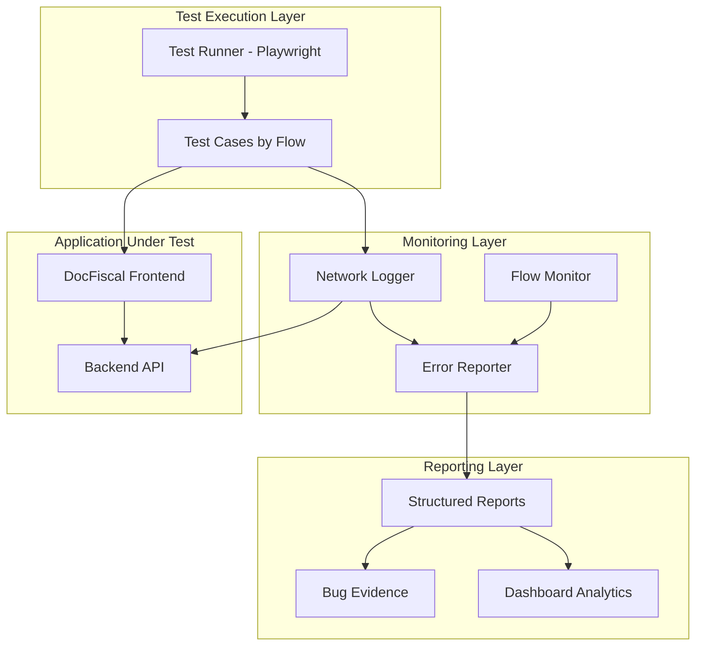

# Design Document: E2E Flow Testing System

## Overview

This design document outlines the implementation of a comprehensive end-to-end testing system using Playwright to map and validate all critical business flows in the DocFiscal PDF-to-CSV conversion application. The system will automatically detect backend failures, provide evidence-based reporting, and ensure reliable user journeys across authentication, file conversion, payment processing, and order management flows.

The solution focuses on business flow validation rather than UI component testing, using network interception to capture backend errors and provide actionable debugging information for development teams.

## Architecture

### High-Level Architecture



### System Flow Mapping

Based on the comprehensive analysis of the DocFiscal system, the following critical business flows and UI elements have been identified:

#### 1. Authentication Flows
- **Login Flow**: `/login` → API `/api/auth/login` → Dashboard redirect
- **Registration Flow**: `/register` → API `/api/auth/register` → Login redirect
- **Token Refresh**: Automatic token refresh on 401 responses
- **Logout Flow**: Sidebar logout button → API `/api/auth/logout` → Landing page

#### 2. Landing Page Flow (Unauthenticated)
- **Landing Page Elements**: Hero section, feature cards, "Como Funciona" section
- **CTA Buttons**: "Fazer Login" and "Criar Conta" buttons
- **Feature Cards**: Processing speed, security, quality cards with icons
- **Navigation**: Login/Register buttons in landing page

#### 3. File Conversion Flow (Main Business Flow)
- **Upload Initiation**: Home page → File selection → API `/api/upload`
- **ConversionFlow Component**: Multi-step process with visual feedback
  - Step 1: File selection with PDF validation
  - Step 2: Payment confirmation with order summary
  - Step 3: Payment waiting with countdown timer
  - Step 4: Processing with progress bar
  - Step 5: Completion with download button
  - Step 6: Error handling with retry options
- **Order Creation**: Upload success → Order creation → Payment initiation
- **Progress Monitoring**: Real-time status updates via polling

#### 4. Payment Processing Flow
- **Payment Creation**: Order → API `/api/orders/{id}/payment` → AbacatePay redirect
- **Payment Monitoring**: Status polling via API `/api/payments/{id}/status`
- **Payment Success Page**: `/payment/success` with status checking
- **Payment Complete Page**: `/payment/complete` with processing monitoring
- **Payment Callbacks**: URL parameters handling and status updates

#### 5. Dashboard and Order Management
- **Sidebar Navigation**: 
  - Convert (home), All files, History, Settings links
  - Recent files section with status indicators
  - User profile section with logout button
- **Dashboard Statistics Cards**: 
  - Total Orders, Pending Payment, Processing, Completed counters
  - Color-coded status indicators
- **Quick Actions**: 
  - Upload New File button
  - Refresh List button
  - Debug buttons (Test API, Debug Payment)
- **Order History Table**: 
  - Desktop table view with sortable columns
  - Mobile card view for responsive design
  - Status badges with icons (pending, processing, completed, failed)
  - Action buttons per order (Pay Now, Download, Processing indicator)
  - Pagination controls (Previous/Next buttons)
  - File size formatting and date formatting
  - Error message display for failed orders

#### 6. Individual Order Status Flow
- **Order Status Page**: `/pedido/[orderId]` with detailed order information
- **OrderStatusCard Component**:
  - Status-specific icons and colors
  - Order details (ID, filename, size, dates)
  - Action buttons based on status
  - Processing animation for active conversions
  - Error messages for failed orders
- **Status-Specific Information Cards**:
  - Payment required instructions
  - Processing information
  - Download ready celebration
- **Order Actions**:
  - Complete Payment button (pending_payment status)
  - Download CSV button (completed status)
  - Processing indicator (processing/paid status)
  - Try Again button (failed status)

#### 7. Download Flow
- **File Download**: Multiple download triggers
  - From dashboard table action buttons
  - From order status page
  - Auto-download after conversion completion
- **Download Methods**: 
  - Direct download via API `/api/orders/{id}/download`
  - Blob handling and file naming
- **Download Validation**: File integrity and format verification

#### 8. Navigation and Layout Elements
- **AppLayout Component**: Main layout wrapper with sidebar
- **Sidebar Elements**:
  - Logo and branding
  - Navigation menu with active states
  - Recent files preview
  - User profile section
- **Responsive Design**: Mobile and desktop layouts
- **Loading States**: Spinners and skeleton loading
- **Error States**: Error boundaries and fallback UI

#### 9. Debug and Testing Pages
- **Debug Payment**: `/debug-payment` for payment flow testing
- **Test API Connection**: `/test-api-connection` for backend connectivity
- **Force Refresh Order**: `/force-refresh-order` for order status updates
- **Test Payment URLs**: `/test-payment-urls` for payment URL validation

#### 10. Real-time Updates and Monitoring
- **Auto-refresh Hooks**: `useOrdersRefresh` and `usePendingPaymentsMonitor`
- **Status Polling**: Automatic status checking for payments and orders
- **Cache Invalidation**: React Query cache updates on status changes
- **Live Status Updates**: Real-time UI updates without page refresh

## Components and Interfaces

### Core Components

#### 1. Network Logger (`helpers/network-logger.ts`)

```typescript
interface NetworkError {
  url: string;
  method: string;
  status: number;
  body: any;
  timestamp: Date;
  requestHeaders: Record<string, string>;
  responseHeaders: Record<string, string>;
}

interface NetworkLogger {
  captureBackendErrors(page: Page, errors: NetworkError[]): void;
  categorizeError(error: NetworkError): 'client' | 'server' | 'network';
  formatErrorReport(errors: NetworkError[]): ErrorReport;
}
```

#### 4. Flow Monitor (`helpers/flow-monitor.ts`)

```typescript
interface FlowStep {
  name: string;
  url: string;
  expectedElements: string[];
  apiCalls: string[];
  timeout: number;
  actions?: UIAction[];
}

interface UIAction {
  type: 'click' | 'fill' | 'select' | 'upload' | 'wait';
  selector: string;
  value?: string;
  file?: string;
}

interface FlowMonitor {
  executeFlow(page: Page, steps: FlowStep[]): Promise<FlowResult>;
  validateStep(page: Page, step: FlowStep): Promise<StepResult>;
  captureFlowEvidence(page: Page): Promise<Evidence>;
  waitForElement(page: Page, selector: string, timeout?: number): Promise<void>;
  waitForApiCall(page: Page, urlPattern: string, timeout?: number): Promise<Response>;
}
```

#### 5. UI Interaction Helper (`helpers/ui-interactions.ts`)

```typescript
interface UIInteractionHelper {
  clickButton(page: Page, buttonText: string): Promise<void>;
  fillForm(page: Page, formData: Record<string, string>): Promise<void>;
  uploadFile(page: Page, fileSelector: string, filePath: string): Promise<void>;
  waitForStatusCard(page: Page, expectedStatus: string): Promise<void>;
  validateTableRow(page: Page, orderId: string, expectedData: any): Promise<void>;
  checkSidebarNavigation(page: Page): Promise<void>;
  validateResponsiveLayout(page: Page, viewport: string): Promise<void>;
}
```

#### 6. Status Polling Helper (`helpers/status-polling.ts`)

```typescript
interface StatusPollingHelper {
  pollOrderStatus(page: Page, orderId: string, expectedStatus: string, timeout?: number): Promise<void>;
  pollPaymentStatus(page: Page, paymentId: string, expectedStatus: string, timeout?: number): Promise<void>;
  monitorRealTimeUpdates(page: Page, elementSelector: string, timeout?: number): Promise<void>;
  validateAutoRefresh(page: Page, refreshInterval: number): Promise<void>;
}
```

#### 3. Authentication Helper (`helpers/auth.ts`)

```typescript
interface AuthHelper {
  login(page: Page, credentials: LoginCredentials): Promise<void>;
  logout(page: Page): Promise<void>;
  isAuthenticated(page: Page): Promise<boolean>;
  getStoredTokens(): Promise<AuthTokens>;
  validateSidebarUserSection(page: Page, expectedUser: User): Promise<void>;
}
```

#### 4. Error Reporter (`helpers/error-reporter.ts`)

```typescript
interface ErrorReport {
  summary: ErrorSummary;
  errors: CategorizedErrors;
  evidence: Evidence[];
  recommendations: string[];
  uiElements: UIElementStatus[];
  flowCoverage: FlowCoverageReport;
}

interface UIElementStatus {
  element: string;
  page: string;
  status: 'working' | 'broken' | 'not_tested';
  error?: string;
  screenshot?: string;
}

interface FlowCoverageReport {
  totalFlows: number;
  testedFlows: number;
  passedFlows: number;
  failedFlows: number;
  coverage: number;
}

interface ErrorReporter {
  generateReport(errors: NetworkError[], flowResults: FlowResult[]): ErrorReport;
  exportToJson(report: ErrorReport): string;
  exportToHtml(report: ErrorReport): string;
  generateUIElementReport(elementTests: UIElementTest[]): UIElementStatus[];
}
```

### Test Organization Structure

```
tests/
├── flows/
│   ├── auth-flow.spec.ts               # Authentication flows (login, register, logout)
│   ├── landing-page.spec.ts            # Landing page elements and navigation
│   ├── upload-conversion.spec.ts       # File upload and conversion flow
│   ├── payment-flow.spec.ts            # Payment processing and callbacks
│   ├── dashboard-navigation.spec.ts    # Dashboard UI elements and navigation
│   ├── order-management.spec.ts        # Order history table and actions
│   ├── order-status.spec.ts            # Individual order status pages
│   ├── download-flow.spec.ts           # File download functionality
│   ├── sidebar-navigation.spec.ts      # Sidebar elements and recent files
│   ├── real-time-updates.spec.ts       # Auto-refresh and status polling
│   └── responsive-design.spec.ts       # Mobile/desktop layout testing
├── helpers/
│   ├── network-logger.ts               # Network monitoring and error capture
│   ├── flow-monitor.ts                 # Flow execution and validation
│   ├── auth.ts                         # Authentication utilities
│   ├── error-reporter.ts               # Error reporting and analysis
│   ├── ui-interactions.ts              # UI element interaction helpers
│   ├── status-polling.ts               # Status monitoring utilities
│   └── setup.ts                        # Test setup and configuration
├── fixtures/
│   ├── test-files/                     # Sample PDFs for testing
│   │   ├── small-document.pdf          # < 1MB test file
│   │   ├── medium-document.pdf         # 1-5MB test file
│   │   ├── large-document.pdf          # > 5MB test file
│   │   └── invalid-file.txt            # Invalid file for error testing
│   ├── mock-responses/                 # Mock API responses
│   │   ├── auth-responses.json         # Authentication API responses
│   │   ├── order-responses.json        # Order API responses
│   │   └── payment-responses.json      # Payment API responses
│   └── test-data.json                  # Test user credentials and data
├── reports/                            # Generated test reports
│   ├── error-reports/                  # Backend error analysis
│   ├── flow-reports/                   # Flow execution results
│   └── screenshots/                    # Failure screenshots
└── playwright.config.ts                # Playwright configuration
```

## Data Models

### Network Error Model

```typescript
interface NetworkError {
  id: string;
  timestamp: Date;
  flow: string;
  step: string;
  request: {
    url: string;
    method: string;
    headers: Record<string, string>;
    body?: any;
  };
  response: {
    status: number;
    statusText: string;
    headers: Record<string, string>;
    body?: any;
  };
  category: 'client' | 'server' | 'network';
  severity: 'low' | 'medium' | 'high' | 'critical';
}
```

### Flow Result Model

```typescript
interface FlowResult {
  flowName: string;
  status: 'passed' | 'failed' | 'skipped';
  duration: number;
  steps: StepResult[];
  errors: NetworkError[];
  evidence: Evidence[];
  metadata: {
    browser: string;
    viewport: string;
    timestamp: Date;
  };
}

interface StepResult {
  name: string;
  status: 'passed' | 'failed' | 'skipped';
  duration: number;
  error?: string;
  screenshot?: string;
}
```

### Error Report Model

```typescript
interface ErrorReport {
  summary: {
    totalTests: number;
    passedTests: number;
    failedTests: number;
    totalErrors: number;
    criticalErrors: number;
    executionTime: number;
  };
  errorsByEndpoint: Record<string, NetworkError[]>;
  errorsByType: Record<string, NetworkError[]>;
  flowResults: FlowResult[];
  recommendations: string[];
  generatedAt: Date;
}
```

## Correctness Properties

*A property is a characteristic or behavior that should hold true across all valid executions of a system—essentially, a formal statement about what the system should do. Properties serve as the bridge between human-readable specifications and machine-verifiable correctness guarantees.*

### Property Reflection

After analyzing the acceptance criteria, I identified several properties related to network error capture and reporting. Some properties were consolidated to avoid redundancy:

- Properties 3.1 and 3.2 were combined into a single comprehensive property about error capture completeness
- Properties 9.1, 9.2, and 9.3 were consolidated into one property about report structure and content
- Error categorization properties were merged to avoid duplication

### Core Properties

**Property 1: Complete Error Capture**
*For any* HTTP response with status ≥ 400 during test execution, the Network Logger should capture all required details including method, URL, status code, response body, and timestamp
**Validates: Requirements 3.1, 3.2**

**Property 2: Test Failure on Backend Errors**
*For any* test execution where backend errors occur, the test should fail with detailed error information including the specific error details and context
**Validates: Requirements 3.3**

**Property 3: Structured Error Logging**
*For any* captured error, the logged data should follow a consistent structured format that includes all required fields for analysis
**Validates: Requirements 3.4**

**Property 4: Error Type Classification**
*For any* captured backend error, the system should correctly classify it as either client error (4xx) or server error (5xx) based on the HTTP status code
**Validates: Requirements 3.5**

**Property 5: Comprehensive Error Reporting**
*For any* test execution, the generated report should contain structured error categorization by endpoint, method, and error type, along with actionable debugging information
**Validates: Requirements 9.1, 9.2, 9.3**

**Property 6: Error Source Classification**
*For any* error encountered during testing, the system should correctly distinguish between frontend issues (JavaScript errors, UI failures) and backend failures (HTTP errors, API failures)
**Validates: Requirements 9.5**

**Property 7: Test Execution Reporting**
*For any* test run, the system should generate clear execution reports containing pass/fail status, execution time, and error summaries
**Validates: Requirements 10.2**

**Property 8: Debugging Information Completeness**
*For any* test failure, the system should provide sufficient debugging information including error context, request/response details, and failure location
**Validates: Requirements 10.4**

## Error Handling

### Error Categories

1. **Network Errors**: Connection failures, timeouts, DNS resolution issues
2. **Client Errors (4xx)**: Authentication failures, validation errors, not found errors
3. **Server Errors (5xx)**: Internal server errors, service unavailable, database errors
4. **Frontend Errors**: JavaScript exceptions, UI component failures, navigation issues

### Error Handling Strategy

```typescript
class ErrorHandler {
  handleNetworkError(error: NetworkError): void {
    // Log error with full context
    // Categorize error type
    // Determine if test should fail or continue
    // Capture evidence (screenshots, network logs)
  }
  
  handleFlowFailure(flow: string, step: string, error: Error): void {
    // Mark flow as failed
    // Capture current page state
    // Log failure context
    // Generate debugging information
  }
  
  handleTestTimeout(test: string, timeout: number): void {
    // Capture page state at timeout
    // Log pending network requests
    // Generate timeout analysis
  }
}
```

### Retry and Recovery

- **Network Timeouts**: Automatic retry with exponential backoff
- **Flaky Tests**: Retry failed tests up to 3 times before marking as failed
- **Authentication Failures**: Automatic re-authentication and test continuation
- **Page Load Failures**: Retry page navigation with different strategies

## Testing Strategy

### Dual Testing Approach

The testing strategy employs both unit tests and property-based tests to ensure comprehensive coverage:

**Unit Tests**:
- Validate specific flow examples and edge cases
- Test error handling scenarios with known inputs
- Verify integration points between components
- Test authentication flows with valid/invalid credentials

**Property-Based Tests**:
- Verify universal properties across all network interactions
- Test error capture completeness with randomized error scenarios
- Validate report generation with various error combinations
- Ensure consistent behavior across different browser environments

### Property-Based Testing Configuration

- **Testing Library**: Playwright with custom property test framework
- **Minimum Iterations**: 100 iterations per property test
- **Test Tagging**: Each property test tagged with format: **Feature: e2e-flow-testing, Property {number}: {property_text}**
- **Error Generation**: Custom error generators for different HTTP status codes and network conditions

### Test Execution Strategy

1. **Flow-Based Organization**: Tests organized by business flows rather than technical components
2. **Parallel Execution**: Tests run in parallel where possible to reduce execution time
3. **Environment Isolation**: Each test runs in isolated browser context
4. **Data Management**: Test data reset between test runs for consistency
5. **Evidence Collection**: Automatic screenshot and network log capture on failures

### Monitoring and Reporting

- **Real-time Monitoring**: Live dashboard showing test execution progress
- **Error Aggregation**: Automatic grouping of similar errors across test runs
- **Trend Analysis**: Historical tracking of error patterns and test stability
- **Alert System**: Notifications for critical test failures or error spikes

### CI/CD Integration

- **Automated Execution**: Tests run on every pull request and deployment
- **Environment Testing**: Separate test suites for staging and production environments
- **Performance Monitoring**: Track test execution time and identify slow tests
- **Report Integration**: Automatic report generation and distribution to development teams