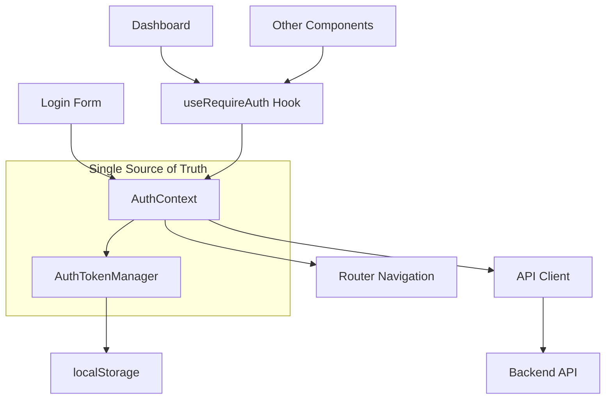

# Design Document

## Overview

Este documento descreve a solução para o problema de redirecionamento após login em produção. O problema principal é a existência de múltiplas implementações de autenticação conflitantes (`useAuth`, `useAuthNew`, `AuthContext`) que causam inconsistências no estado de autenticação e redirecionamentos incorretos.

A solução envolve consolidar todas as implementações em uma única fonte de verdade, corrigir o fluxo de armazenamento de tokens, e implementar logging robusto para diagnóstico.

## Architecture

### Current State Problems

1. **Multiple Auth Implementations**: 
   - `src/hooks/useAuth.ts` (versão original)
   - `src/hooks/useAuthNew.ts` (versão simplificada)
   - `src/contexts/AuthContext.tsx` (context-based)

2. **Token Management Inconsistencies**:
   - `AuthTokenManager.ts` usa chaves específicas (`docfiscal_*`)
   - `api.ts` usa chaves genéricas (`access_token`, `refresh_token`)

3. **State Synchronization Issues**:
   - Diferentes hooks podem ter estados diferentes
   - Race conditions entre verificações de auth

### Target Architecture



## Components and Interfaces

### 1. Unified AuthContext (Primary Implementation)

**Location**: `src/contexts/AuthContext.tsx`

**Responsibilities**:
- Manage authentication state globally
- Handle login/logout operations
- Coordinate with AuthTokenManager
- Provide consistent auth state to all components

**Interface**:
```typescript
interface AuthContextType {
  user: User | null;
  isLoading: boolean;
  isAuthenticated: boolean;
  login: (email: string, password: string) => Promise<AuthResult>;
  logout: () => Promise<void>;
  refreshSession: () => Promise<boolean>;
  checkAuthStatus: () => Promise<void>;
}
```

### 2. Enhanced AuthTokenManager

**Location**: `src/lib/AuthTokenManager.ts`

**Responsibilities**:
- Centralized token storage and retrieval
- Automatic token refresh
- Consistent localStorage key management
- Token validation and expiration handling

**Key Changes**:
- Standardize on single set of localStorage keys
- Improve error handling and logging
- Add production-specific configurations

### 3. Simplified API Client Integration

**Location**: `src/lib/api.ts`

**Responsibilities**:
- Use AuthTokenManager for all token operations
- Remove duplicate token management logic
- Consistent authentication headers

### 4. Unified Auth Hooks

**Location**: `src/hooks/useAuth.ts` (consolidated)

**Responsibilities**:
- Provide React hooks interface to AuthContext
- Handle component-level auth requirements
- Manage loading states and redirects

## Data Models

### User Model
```typescript
interface User {
  id: string;
  email: string;
  name: string;
  created_at: string;
  updated_at: string;
}
```

### Auth State Model
```typescript
interface AuthState {
  user: User | null;
  isLoading: boolean;
  isAuthenticated: boolean;
  error: string | null;
  lastAuthCheck: Date | null;
}
```

### Token Model
```typescript
interface AuthTokens {
  accessToken: string;
  refreshToken: string;
  expiresAt: Date;
}
```

## Correctness Properties

*A property is a characteristic or behavior that should hold true across all valid executions of a system-essentially, a formal statement about what the system should do. Properties serve as the bridge between human-readable specifications and machine-verifiable correctness guarantees.*

### Property 1: Token Storage and Synchronization Integrity
*For any* successful authentication operation, tokens should be stored consistently in localStorage and the authentication state should be immediately synchronized across all components.
**Validates: Requirements 1.2, 3.1, 3.2**

### Property 2: Authentication State Consistency
*For any* authentication check performed by different hooks or components, they should return consistent authentication status and user information.
**Validates: Requirements 1.3, 1.4, 2.3, 2.4**

### Property 3: Correct Redirect Behavior
*For any* authentication state change, the system should redirect appropriately (authenticated to dashboard, unauthenticated to login) without creating infinite redirect loops.
**Validates: Requirements 3.3, 3.4, 4.4, 5.2**

### Property 4: Session Persistence and Recovery
*For any* page reload or browser restart with valid tokens in localStorage, the authentication state should be automatically restored, and expired tokens should trigger refresh attempts before falling back to login.
**Validates: Requirements 4.1, 4.2, 4.3**

### Property 5: Comprehensive Error Handling
*For any* authentication error (network, invalid tokens, server unavailable, CORS), the system should provide specific error messages and handle the error gracefully without crashes.
**Validates: Requirements 5.1, 5.2, 5.3, 5.4**

### Property 6: Production Environment Compatibility
*For any* production deployment configuration, the system should automatically adapt to use correct API URLs, handle HTTPS properly, manage CORS correctly, and work with production environment variables.
**Validates: Requirements 6.1, 6.2, 6.3, 6.4**

### Property 7: Comprehensive Authentication Logging
*For any* authentication operation (login attempts, token operations, errors, redirects), the system should generate detailed logs with sufficient information for debugging and monitoring.
**Validates: Requirements 7.1, 7.2, 7.3, 7.4**

## Error Handling

### 1. Network Errors
- Detect connection failures
- Provide user-friendly error messages
- Implement retry mechanisms for transient failures

### 2. Token Expiration
- Automatic refresh token usage
- Graceful fallback to login when refresh fails
- Clear expired tokens from storage

### 3. Invalid Credentials
- Clear error messaging
- Prevent infinite retry loops
- Secure token cleanup

### 4. Production-Specific Issues
- HTTPS/HTTP protocol handling
- CORS error detection and guidance
- Environment variable validation

## Testing Strategy

### Unit Tests
- Test individual auth functions
- Mock localStorage operations
- Test error conditions and edge cases
- Verify token validation logic

### Property-Based Tests
- Test authentication state consistency across random operations
- Verify token storage/retrieval with various token formats
- Test redirect behavior with different authentication states
- Validate session persistence across random page reloads

### Integration Tests
- Test complete login flow from form to dashboard
- Test logout and session cleanup
- Test automatic token refresh scenarios
- Test production environment configurations

### Manual Testing Checklist
- Login in production environment
- Page refresh after login
- Token expiration handling
- Network disconnection scenarios
- Browser localStorage manipulation

## Implementation Plan

### Phase 1: Consolidation
1. Deprecate `useAuthNew.ts`
2. Enhance `AuthContext.tsx` as primary implementation
3. Update `AuthTokenManager.ts` for consistency
4. Modify `api.ts` to use AuthTokenManager

### Phase 2: Bug Fixes
1. Fix token storage key inconsistencies
2. Implement proper redirect logic
3. Add comprehensive error handling
4. Enhance logging for debugging

### Phase 3: Testing & Validation
1. Implement property-based tests
2. Add integration tests
3. Test in production-like environment
4. Performance and reliability testing

### Phase 4: Deployment & Monitoring
1. Deploy with feature flags
2. Monitor authentication metrics
3. Collect user feedback
4. Performance monitoring