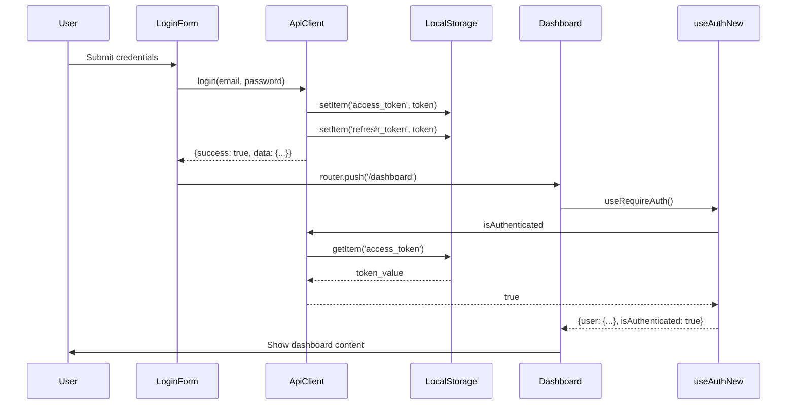
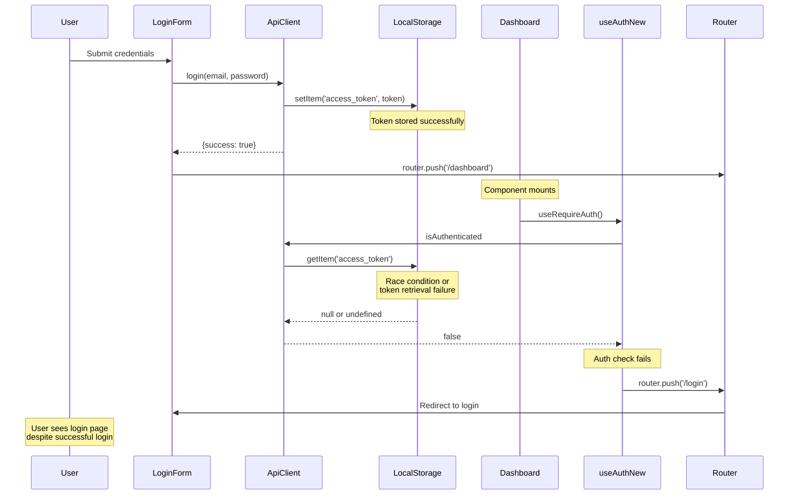
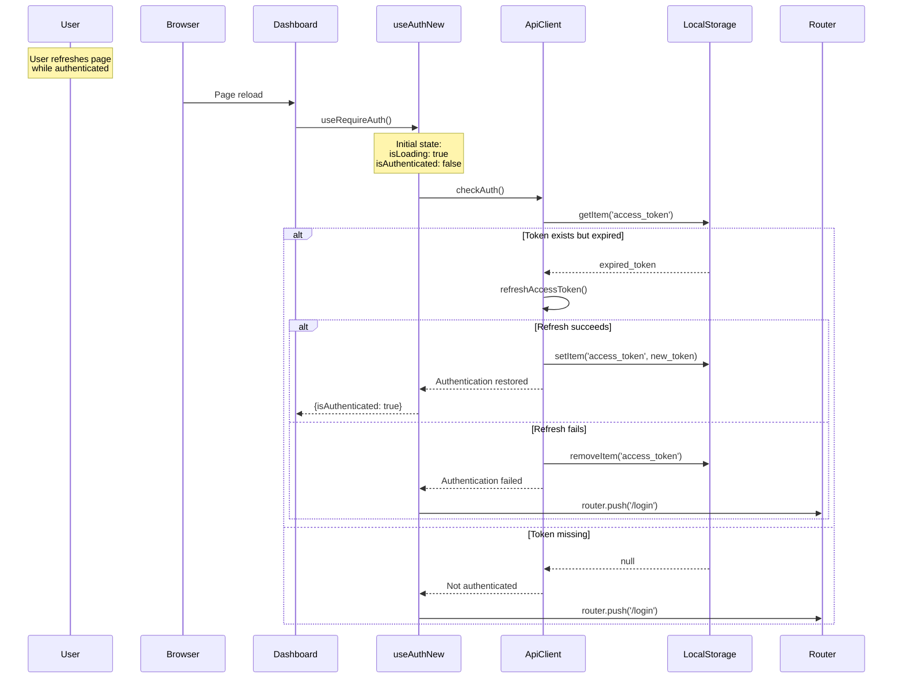
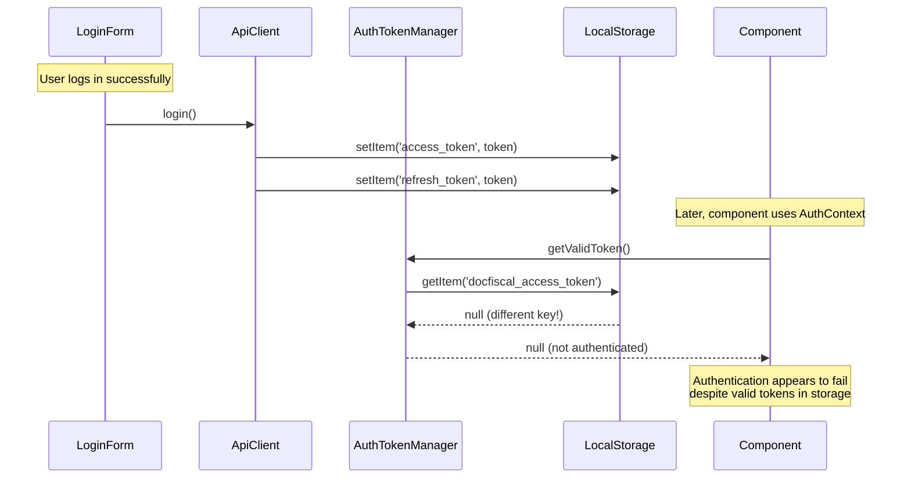
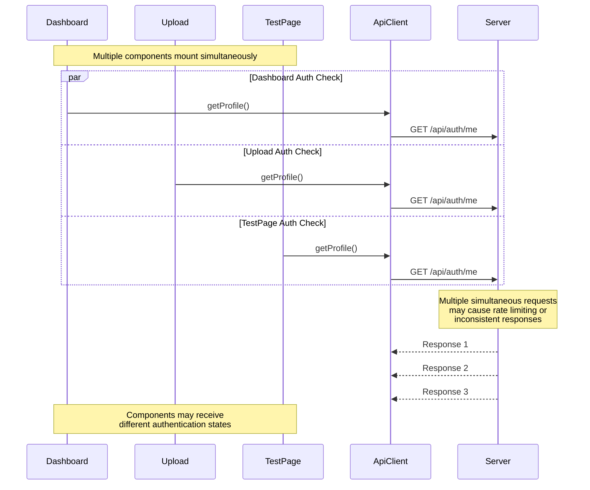
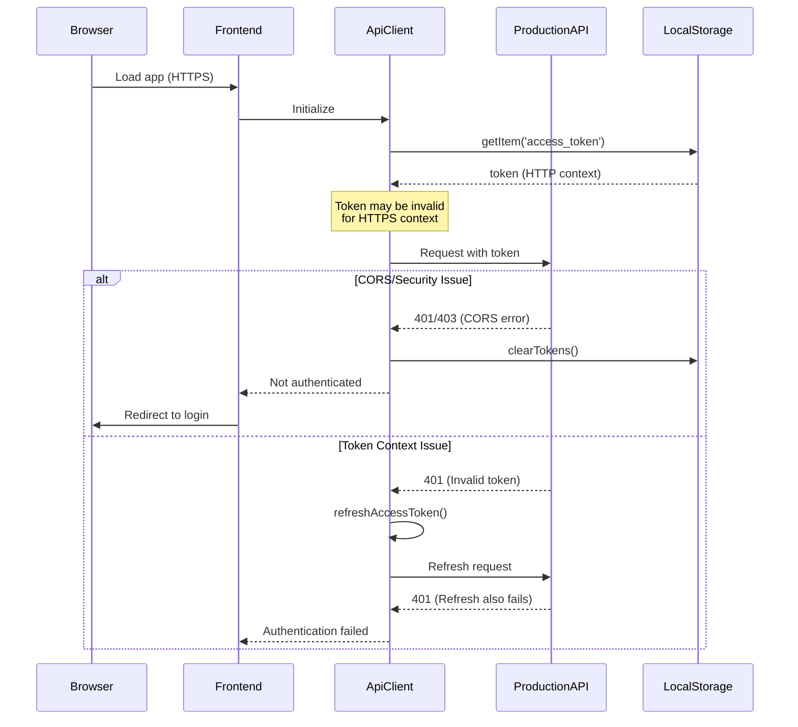
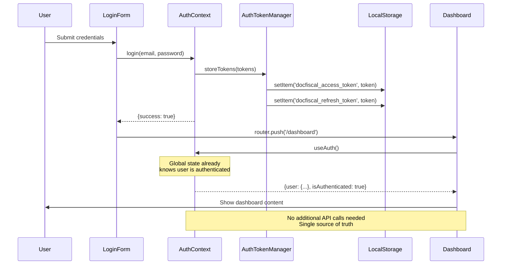

# Authentication Redirect Flow Analysis

## Current Problematic Flows

### Flow 1: Successful Login → Dashboard (Working Case)

### Flow 2: Login → Redirect Loop (Production Issue)

### Flow 3: Page Refresh → Authentication Loss

## Token Storage Inconsistency Flows

### Flow 4: AuthTokenManager vs ApiClient Mismatch

## Race Condition Scenarios

### Flow 5: Multiple Components Checking Auth Simultaneously

## Production Environment Specific Issues

### Flow 6: HTTPS/CORS Issues in Production

## Identified Root Causes

### 1. Token Storage Key Mismatch
- **ApiClient** uses: `access_token`, `refresh_token`
- **AuthTokenManager** uses: `docfiscal_access_token`, `docfiscal_refresh_token`
- **Result**: Systems cannot read each other's tokens

### 2. Multiple Authentication State Sources
- Each component maintains independent auth state
- No centralized state management
- Race conditions between components

### 3. Missing Global Authentication Provider
- `AuthProvider` not integrated in app layout
- Components use different auth implementations
- No shared authentication context

### 4. Inconsistent Redirect Logic
- Multiple components can trigger redirects
- No coordination between redirect attempts
- Potential for infinite redirect loops

### 5. Production Environment Differences
- Different API URLs between dev/prod
- HTTPS vs HTTP token context issues
- CORS configuration problems

## Recommended Flow (Target State)

### Flow 7: Unified Authentication Flow

## Testing Scenarios Required

### 1. Token Storage Consistency Tests
- Verify tokens stored by one system can be read by another
- Test token migration between key formats
- Validate token expiration handling

### 2. Redirect Behavior Tests
- Test successful login → dashboard flow
- Test authentication failure → login redirect
- Test prevention of infinite redirect loops

### 3. Race Condition Tests
- Test multiple components mounting simultaneously
- Test concurrent authentication checks
- Test state synchronization across components

### 4. Production Environment Tests
- Test HTTPS token handling
- Test CORS configuration
- Test environment variable usage

### 5. Session Persistence Tests
- Test page refresh with valid tokens
- Test browser restart with stored tokens
- Test token refresh on expiration